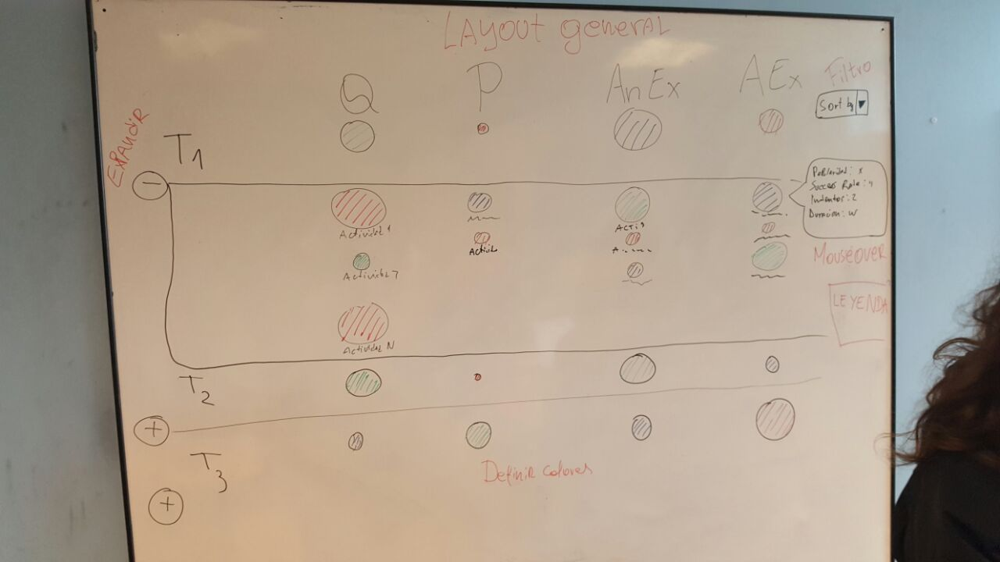
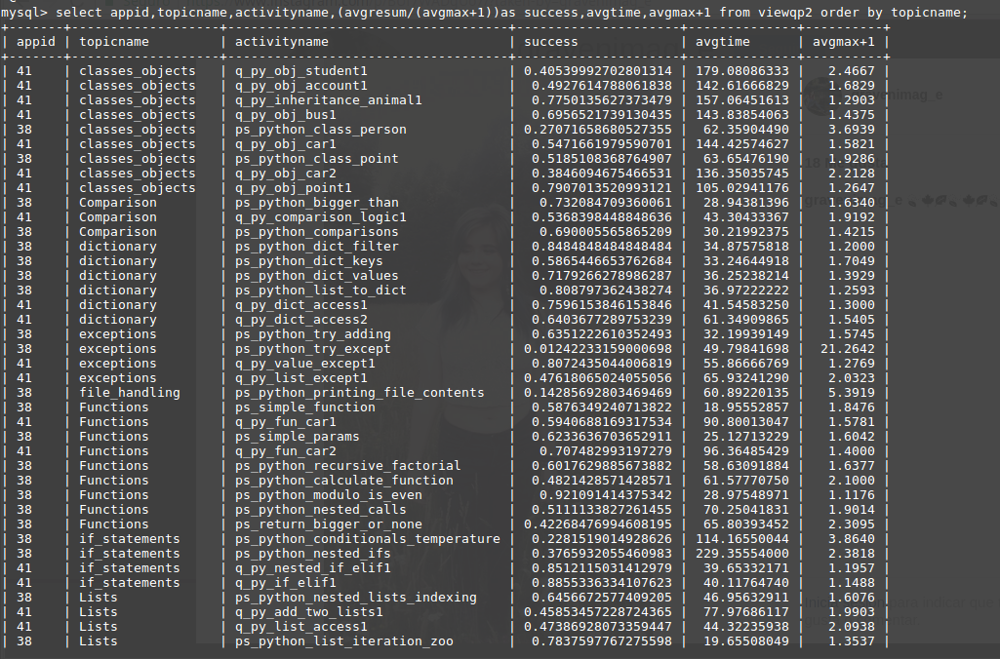

# 666 Caballeros de la Muerte

**Integrantes:**
* Leah S. Bracken.
* Roberto Melita.
* Felipe Quezada.
* Javier Rojas.
* Diego Vera.

**Requerimiento General:**
* Comparar la efectividad / dificultad del material. Por ejemplo, visualizar la tasa de respuestas correctas de cada problema, o el tiempo medio en resolverlo para ver que problemas son más difíciles.

**Historias de usuario:**
* Como Profesor, deseo un Software que me muestre el rendimiento de mi material para poder mejorarlo en el futuro.

**Feedback (Primera presentación):**
* Vista general no es clara.
* No se aprovecha el espacio en pantalla (la posicion no significa nada).

**Feedback (Segunda presentacion):**
* Vista general secundaria (matriz), quedará como la principal y única.
* No comparar los grupos; comparar las actividades entre si.

**Feedback (Tercera presentación):**
* Incorporar tamaño como metodo de comparación.
* Ejemplos:
* Comparar por número de intentos o tiempo.
* Usar otra escala de color para examples y examples animation.
* Comparar por relación de repuestas correctas o fallidas.
* Por lo tanto cambiaremos el esquema para adecuarnos.

**Feedback (cuarta presentación):**
* incorporar mockup de despliegue por topico.
* incorporar popularidad como parametro principal.
* parametro tiempo será visualizado con un mouse over

**4 de mayo del 2017**
* Hablamos directamente con el profesor en su oficina para evaluarnos y aconsejarnos sobre que aspectos del proyecto podemos mejorar para la visualización, generando así una tabla con cada factor de decisión, con una jerarquia de priorización que nos sirve para ser mas organizados y estructurados al hacer un cambio.
* Repartiendo así equitativamente entre los integrantes de nuestro grupo las tareas y responsabilidad.

**11 de mayo del 2017**
* El profesor estaba enfermo, por lo cual nos entregó una hoja guia con la Actividad Clase 9, la cual desarrollamos con mucho entusiasmo, ya que gran parte de esta actividad ya la habiamos avanzado antes, por lo cual nuestra experiencia con MySQL era ventajosa a la hora de de hacer las consultas, por lo tanto, en la clase nos concentramos en crear la version preliminar del servicio siguiendo nuestra especificacion de JSON.

**18 de mayo del 2017**
* Solo estuvo presente Leah Bracken, debido a que los demas integrantes del grupo estuvieron disfrutando de la famosa semana mechona, por lo cual, Leah nos puso al dia con la actividad(Disculpanos Leah :c).
**Nuestro Team visualización esta conformado por:**
* Roberto Melita
* Felipe Quezada
* Leah Bracken

**Team Servicio de datos:**
* Javier Rojas
* Diego Vera

**Documentador:**
* Diego Vera

* Respecto al codigo de la visualizacion; Utilizamos variables estaticas definidas para mostrar en pantalla, las cuales solo son momentaneas hasta que se tenga correctamente la base de datos.
* Mientras que la funcionalidad; Avanzamos en el contenedor de los elementos de la visualizacion, el dezpliegue de headers, dezpliegue de tópicos y de circulos(aun sin la escalas de colores correctas que habiamos propuesto).

* Representación gráfica.

* Respecto al servicio de datos, avanzamos y mejoramos la consulta en MySql, creando funciones que solicitan lo que la visualizacion necesitará mas adelante.

* Vista Gráfica de la consulta en MySql.

**25 de Mayo**
* Nos reunimos con el profesor para hablar sobre el avance que llevamos en el proyecto y que aspectos debiamos mejorar en nuestra plataforma github, recordarnos que debemos priorizar según nuestro Plan666 y hablar sobre la visualización en general para despues presentarla en la semana siguiente.

**1 de Junio**
* Se suspendieron las clases, por lo que enviamos nuestra presentación al correo del profesor.

**8 de Junio**
* Presentamos nuestra visualizacion y explicamos el codigo, obteniendo criticas positivas, faltando leyenda del radio y los colores para animated examples.
* Tambien nos falto avanzar el codigo en el servlet para las consultas.

 **22 de junio**
 * Nos juntamos con el profesor para conversar sobre la finalizacion de nuestro proyecto, dejandonos en claro cuales eran los objetivos que debiamos terminar para la ultima presentación, las cuales eran.
 -Hacer escala del tiempo en la leyenda
 -Terminar las consultas
 -Renombrar los servicios
 -Mostrar los nombres de cada topico
 -Visualizacion principal sin scroll
 
